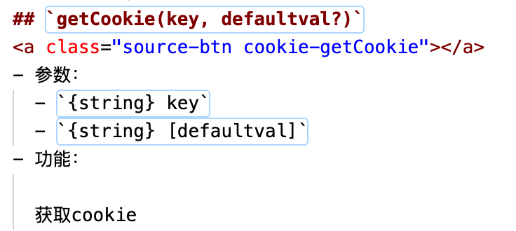

## v-func-line

为Vuepress文档增加源代码链接的插件

### 使用方法

1、安装包

```bash
npm install v-func-line --save-dev
```

2、在`markdown`文件的API标题后添加`a`标签，格式为：

```html
<a class="source-btn ${文件名}-${函数名}"></a>
```
示例如下：



3、在`.vuepress/enhanceApp.js`中使用

```js
import VFuncLine from 'v-func-line';

const funcLineMap = {
  "city-getAreaDataAll": "/src/utils/city/index.js#L3",
  "city-getAreaData": "/src/utils/city/index.js#L17",
  "city-getAreaCode": "/src/utils/city/index.js#L65",
}

Vue.use(VFuncLine, {
  funcLineMap, // 函数和文件名行号的对象
  delay: 300, // mounted后的延迟执行时间
  gitLink: // git仓库路径地址
});
```


### 注意

1. `funcLineMap`的键名形式为`${文件名}-${函数名}`;
2. `funcLineMap`的值名与`gitLink`拼接后为文件真实路径;

